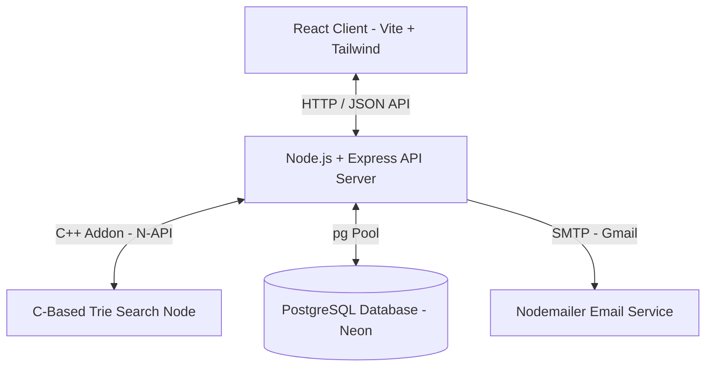

# Smart Faculty Directory 🎓

A premium, full-stack campus portal designed to help students instantly find faculty members, check real-time availability in the IST timezone, schedule appointments dynamically, and navigate the campus efficiently. The system utilizes optimized algorithms and advanced data structures to solve complex timetable scheduling, routing, search, and queue management challenges.

---

## 🚀 Key Features

- **Instant Faculty Search**: Search faculty by name, initials, department, or specialization with O(L) time complexity prefix matching.
- **Real-Time Availability Status**: Automatically determines if a faculty member is `"In Class"`, `"Likely Available"`, `"On Leave"`, or `"Exam Duty"` based on active timetables.
- **Fuzzy Search Suggestions**: Handles typos and misspelt names gracefully using edit-distance calculations.
- **Conflict-Free Timetable Creation**: Ensures no overlapping lecture slots are scheduled for the same faculty member.
- **Smart Appointment Scheduling**: Group appointment requests are automatically scheduled, adjusted, or rejected based on slot availability.
- **Office Hours Queue**: Live prioritized queue system where students can line up based on inquiry urgency.
- **Backtracking Timetable Optimizer**: Optimizes multi-hour course allocations for faculty without scheduling conflicts.
- **Real Email Verification**: User signup (students/faculty) restricted to institutional domain with real-time email verification via Nodemailer/Gmail.
- **Modern Glassmorphic UI**: Premium responsive UI built with Tailwind CSS, supporting dark/gradient themes and micro-animations.

---

## 🛠️ System Architecture & Tech Stack



### Frontend
- **React (Vite)**: Fast, component-based modern UI.
- **Tailwind CSS**: Glassmorphic aesthetic, responsive grid, dynamic transitions.
- **React Router DOM**: Client-side routing for seamless page navigation.

### Backend
- **Node.js & Express**: Event-driven API server handling auth, profile management, and scheduling.
- **Node-GYP / N-API**: Compiles and runs high-performance C structures directly in JS.

### Database
- **PostgreSQL (Neon / Local)**: Secure relational database managing tables for users, faculty details, and timetables.

---

## 🧠 Core Algorithms & Data Structures

At the heart of the Smart Faculty Directory is a suite of custom-implemented computer science data structures and algorithms:

### 1. Trie Search (C Native Addon)
* **Purpose**: Fast search suggestions.
* **Implementation**: Implemented in native C (`server/trie-c/`) and compiled as a Node.js C++ Addon. Matches characters along a prefix tree to return potential completions in $O(L)$ time, where $L$ is the prefix length.
* **Fuzzy Matching**: Uses Levenshtein distance calculations on the Trie structure to suggest corrections for typos up to a threshold.

### 2. KMP (Knuth-Morris-Pratt) Algorithm
* **Purpose**: Keyword-based expertise search.
* **Implementation**: Located in `server/lib/KMP.js`. Scans research papers and specialization details in $O(N + M)$ time to find matching substrings without redundant backtracking.

### 3. Segment Tree
* **Purpose**: O(log N) overlap check.
* **Implementation**: Located in `server/lib/SegmentTree.js`. Represents time intervals as a range query tree. Detects conflicts when creating new timetable slots by querying time overlaps in $O(\log N)$ time.

### 4. Interval Tree
* **Purpose**: Finding schedule gaps.
* **Implementation**: Located in `server/lib/IntervalTree.js`. Organizes busy slots as interval tree nodes, allowing the application to quickly search for free time segments (gaps) inside standard working hours.

### 5. Interval Scheduler (Greedy Algorithm)
* **Purpose**: Auto-scheduling pending meetings.
* **Implementation**: Located in `server/lib/IntervalScheduler.js`. Employs a greedy interval scheduling algorithm that sorts requested meetings by end time to maximize the number of non-overlapping appointments accepted, while adjusting timings of near-misses.

### 6. Urgency-Based Priority Queue (Min-Heap / Array Queue)
* **Purpose**: Office hours queue management.
* **Implementation**: Located in `server/lib/PriorityQueue.js`. Sorts student walk-in requests dynamically by inquiry urgency (High, Medium, Low) so that urgent academic issues are served first.

### 7. Backtracking Scheduler
* **Purpose**: Timetable optimization.
* **Implementation**: Located in `server/lib/Scheduler.js`. Solves the constraint-satisfaction problem of generating a weekly timetable layout for multiple courses by back-tracking when slot conflicts arise.

---

## 📁 Repository Structure

```
├── client/                 # React frontend application
│   ├── src/
│   │   ├── App.jsx         # Routing & primary app entry
│   │   ├── Dashboard.jsx   # Main view for students & faculty
│   │   ├── SearchBar.jsx   # Prefix search bar UI
│   │   └── ...             # Other premium UI views
│   └── package.json
│
├── server/                 # Express backend API
│   ├── database/
│   │   └── schema.sql      # Database initialization schema
│   ├── lib/                # Custom data structures & algorithms
│   │   ├── KMP.js
│   │   ├── SegmentTree.js
│   │   ├── IntervalTree.js
│   │   ├── IntervalScheduler.js
│   │   ├── PriorityQueue.js
│   │   └── Scheduler.js
│   ├── trie-c/             # C implementation of Trie prefix tree
│   │   ├── trie.c
│   │   ├── trie.h
│   │   └── addon.c
│   ├── trie.js             # Javascript wrapper for the C addon
│   ├── index.js            # Express routes and startup script
│   └── package.json
```

---

## ⚙️ Installation & Setup

### Prerequisites
- Node.js (v16+ recommended)
- PostgreSQL
- Build tools (like `make`, `gcc`/`clang`, or Build Tools for VS on Windows) for compiling the C native addon.

### 1. Database Setup
Create a PostgreSQL database named `smart_faculty`. Populate the initial schema and basic faculty list:
```bash
psql -U postgres -d smart_faculty -f server/database/schema.sql
```

### 2. Environment Variables Configuration
Create a `.env` file inside the `server/` directory and configure the variables:
```env
PORT=5001

# Database Configuration (Local or Neon)
DATABASE_URL=postgres://<user>:<password>@localhost:5432/smart_faculty
NEON_DATABASE_URL=<your-neon-url-if-applicable>

# Frontend URL (Used for post-verification redirect)
FRONTEND_URL=http://localhost:5173

# Gmail SMTP Credentials (For verification mails)
EMAIL_USER=your_email@gmail.com
EMAIL_APP_PASSWORD=your_16_character_app_password
```

### 3. Server Installation & Building Native Addon
Navigate to the server directory, install dependencies, and compile the C addon:
```bash
cd server
npm install
```
*Note: Installing dependencies automatically triggers `node-gyp rebuild` to compile the native Trie binary.*

Run the migrations to update existing schemas and tables:
```bash
node migrate_login_refactor.js
```

Seed the database with real or ECE department sample data:
```bash
node seed_real_data.js
node seed_ece_data.js
```

### 4. Client Installation
Navigate to the client directory and install dependencies:
```bash
cd ../client
npm install
```

---

## 🏃 Running the Application

### Start Backend Server
From the `server/` folder:
```bash
npm run dev
```
The server will run on `http://localhost:5001`.

### Start Frontend Client
From the `client/` folder:
```bash
npm run dev
```
The client will start on `http://localhost:5173`. Open this URL in your web browser.

---

## 🧪 Testing

The codebase includes targeted backend test scripts to verify constraints and algorithms:

- **Verify Trie Addon**:
  ```bash
  node server/test_c_trie.js
  ```
- **Verify KMP String Matcher**:
  ```bash
  node server/test_kmp.js
  ```
- **Verify Smart Appointment Scheduler**:
  ```bash
  node server/test_smart_scheduling.js
  ```
- **Verify Domain Restrictions on Signup**:
  ```bash
  node server/test_domain_restriction.js
  ```
- **Verify Login and Signup Refactors**:
  ```bash
  node server/test_login_refactor.js
  ```
